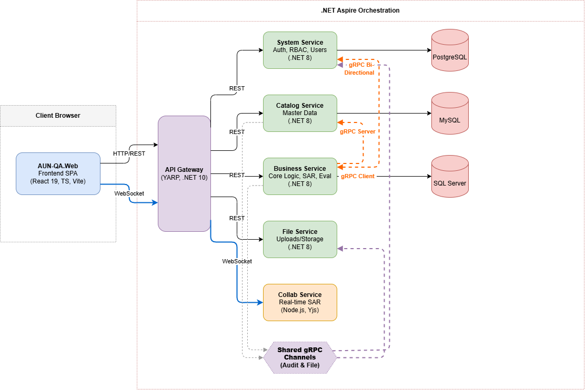
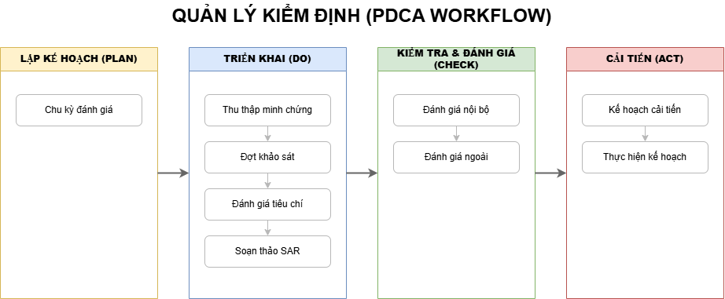
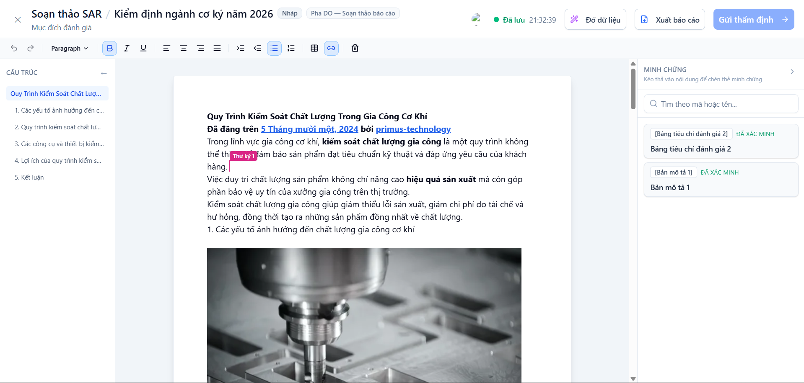
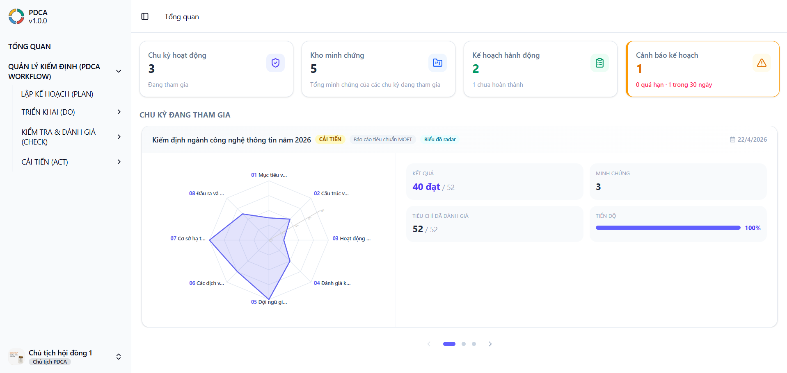
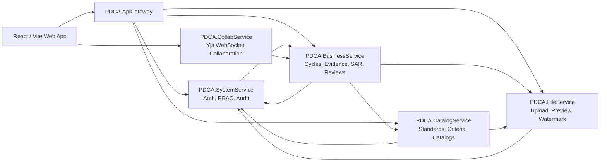

# PDCA - Quality Assurance Management Platform


PDCA is a full-stack quality assurance management platform designed around the Plan-Do-Check-Act improvement cycle. It helps academic programs organize quality assurance cycles, collect evidence, evaluate criteria, prepare SAR documents, coordinate reviews, and turn findings into actionable improvement plans.

The project supports both **AUN-QA** and **MOET** quality assurance contexts while positioning the system around the broader PDCA workflow.

> Portfolio note: this repository is public so recruiters and reviewers can quickly understand the product scope, architecture, and engineering work behind the project.

## Preview & Architecture

Add project screenshots and diagrams here.

### 1. System Architecture & Workflow

**System Architecture**


**PDCA Workflow**


### 2. Live Collaboration (SAR)
> **Highlight:** Real-time synchronization powered by Yjs, WebSockets, and TipTap.



### 3. Analytics Dashboard
> **Highlight:** Comprehensive metrics and evaluation progress visualization.



## What This Project Demonstrates

- A microservice-oriented .NET backend organized by business domains.
- A React/Vite frontend with role-based workflows and data-heavy management screens.
- A PDCA-based quality assurance lifecycle that connects planning, evidence collection, evaluation, review, and improvement actions.
- Support for AUN-QA and MOET standards as configurable evaluation contexts.
- Real-time SAR collaboration using Yjs and WebSocket infrastructure.
- File preview, upload, watermarking, and document-oriented workflows.
- Automated tests across backend services, frontend components, and the collaboration service.

## Core Features

### PDCA Cycle Management

- Create and manage quality assurance cycles.
- Track cycle stages across the Plan, Do, Check, and Act workflow.
- Coordinate councils, evaluation schedules, standards, and related QA activities.

### Evidence And Criteria Evaluation

- Manage evidence records and file attachments.
- Map evidence to criteria and reuse verified evidence across cycles.
- Evaluate criteria, submit evaluation results, review submissions, and request revisions.
- Visualize evaluation progress and outcomes through dashboard widgets.

### SAR Authoring And Collaboration

- Draft Self-Assessment Reports (SAR) for quality assurance cycles.
- Use a rich editor experience for report content, tables, links, images, and structured evidence references.
- Collaborate in real time through the dedicated collaboration service.
- Persist collaborative SAR snapshots back to the backend.

### Review Workflows

- Support internal review comments and decision flows.
- Manage external review accounts, results, findings, and watermarking requirements.
- Keep review activity connected to cycle visibility and role-based permissions.

### Surveys, Action Plans, And Task Execution

- Build and run survey campaigns for stakeholders.
- Aggregate survey results for evaluation and improvement planning.
- Create action plans from findings and assign improvement tasks.
- Track task execution, attachments, assignees, and completion status.

### System Administration

- Authenticate users and manage accounts.
- Configure roles, menus, permissions, and system groups.
- Record audit logs for traceability.

## Architecture

The application is orchestrated with .NET Aspire and split into focused services:



## Technical Decisions

To provide insight into the engineering process, here is the rationale behind some of the core architectural choices:

- **.NET Aspire for Orchestration:** Chosen over raw Docker Compose for the local development loop to benefit from built-in service discovery, telemetry, and seamless integration with the .NET ecosystem, significantly reducing developer friction.
- **Polyglot Persistence (Database-per-Service):** Instead of a monolithic database, services use the database engine best suited for their domain (SQL Server for core business transactions, PostgreSQL for audit/system logs, MySQL for catalog data). This demonstrates a true microservice data isolation strategy.
- **Yjs & WebSockets for Collaboration:** For the real-time SAR document editing feature, standard API polling or basic SignalR was insufficient. Integrating `Yjs` (a CRDT implementation) with a dedicated Node.js WebSocket server ensures conflict-free, real-time rich text synchronization (TipTap) across multiple concurrent users.
- **gRPC for Internal Communication:** REST (via API Gateway) is strictly used for client-facing endpoints. Internal service-to-service communication relies on gRPC to ensure high performance and strict type-safety via Protobuf contracts.

## Tech Stack

### Frontend

- React 19
- TypeScript
- Vite / Rolldown Vite
- Tailwind CSS
- Radix UI primitives
- TanStack Query
- TanStack Table
- React Hook Form and Zod
- TipTap editor
- Recharts
- Vitest and Testing Library

### Backend

- .NET 8 / ASP.NET Core
- .NET Aspire AppHost
- API Gateway
- Entity Framework Core
- gRPC and Protobuf
- FluentValidation
- AutoMapper
- Swagger / OpenAPI
- SQL Server, MySQL, and PostgreSQL providers across services

### Collaboration And Documents

- Node.js collaboration service
- Yjs
- y-websocket
- WebSocket server
- PDF.js, docx-preview, OpenXML, and file watermarking workflows

## Repository Structure

```text
PDCA.ApiGateway/          API gateway and service routing
PDCA.AppHost/             .NET Aspire orchestration
PDCA.BusinessService/     Core PDCA workflow, SAR, evidence, reviews, surveys, actions
PDCA.CatalogService/      Standards, criteria, faculties, stakeholders, catalog data
PDCA.CollabService/       Real-time Yjs collaboration service
PDCA.FileService/         Upload, preview, watermark, and file APIs
PDCA.ServiceDefaults/     Shared Aspire service defaults
PDCA.Shared/              Shared DTOs, helpers, and cross-service contracts
PDCA.SystemService/       Authentication, users, roles, menus, audit logs
PDCA.Web/                 React frontend
```

## Getting Started

### Prerequisites

- .NET SDK 8 or later
- Node.js
- npm
- Visual Studio 2022 or a compatible .NET IDE

### Restore And Build

```powershell
dotnet restore PDCA.sln
dotnet build PDCA.sln -v minimal
```

### Run With Aspire

```powershell
dotnet run --project PDCA.AppHost\PDCA.AppHost.csproj
```

The Aspire dashboard will show the running services, including the API gateway, backend services, frontend web app, and collaboration service.

### Frontend Only

```powershell
Push-Location PDCA.Web
npm install
npm run dev
Pop-Location
```

### Collaboration Service Only

```powershell
Push-Location PDCA.CollabService
npm install
npm run dev
Pop-Location
```

## Testing

```powershell
dotnet test PDCA.sln --no-build -v minimal
```

```powershell
Push-Location PDCA.Web
npm test
Pop-Location
```

```powershell
Push-Location PDCA.CollabService
npm test
Pop-Location
```

> Note: the direct `PDCA.BusinessService.Tests` suite may require local font support for PDF watermark tests that use `Noto Sans`.

## Engineering Highlights

- Designed a domain-oriented service split for system, catalog, business, file, gateway, and collaboration responsibilities.
- Built a role-aware quality assurance workflow around PDCA stages.
- Implemented complex data workflows for evidence mapping, SAR drafting, internal/external reviews, surveys, and action tracking.
- Added real-time collaboration support for SAR authoring with snapshot persistence.
- Created a frontend with reusable tables, dialogs, upload/preview components, dashboards, and workflow-specific screens.
- Added test coverage for backend contracts, service behavior, frontend workflows, UI behavior, and collaboration utilities.

## Future Improvements

- Add polished screenshots and architecture diagrams to the README.
- Add seed data or a demo account flow for easier reviewer exploration.
- Add a public demo deployment when infrastructure is ready.
- Continue reducing package warnings and tightening CI verification.
